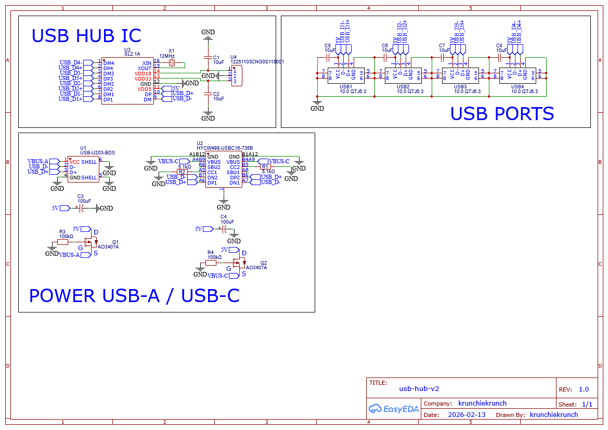
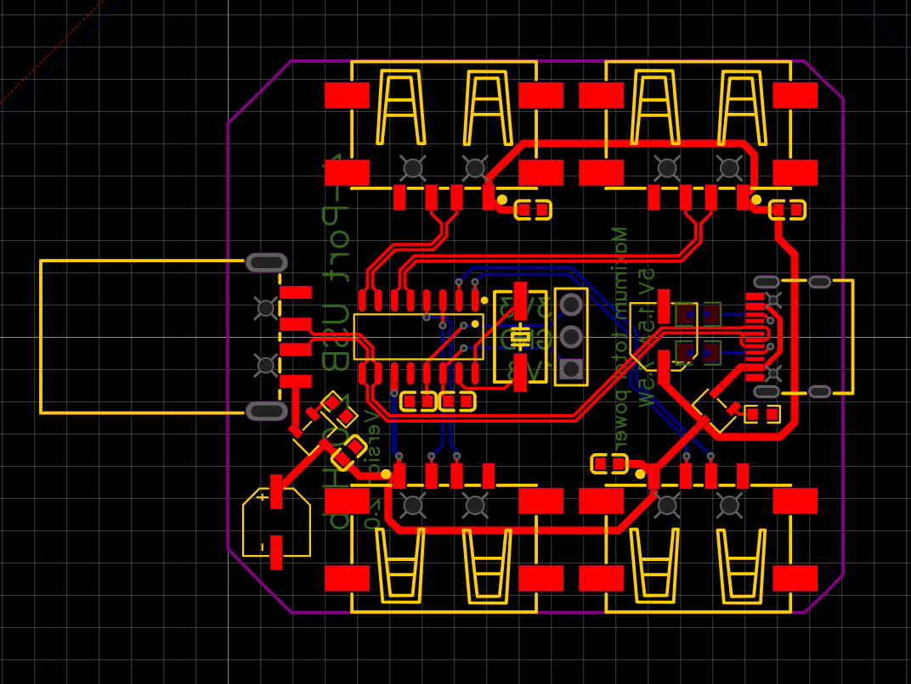
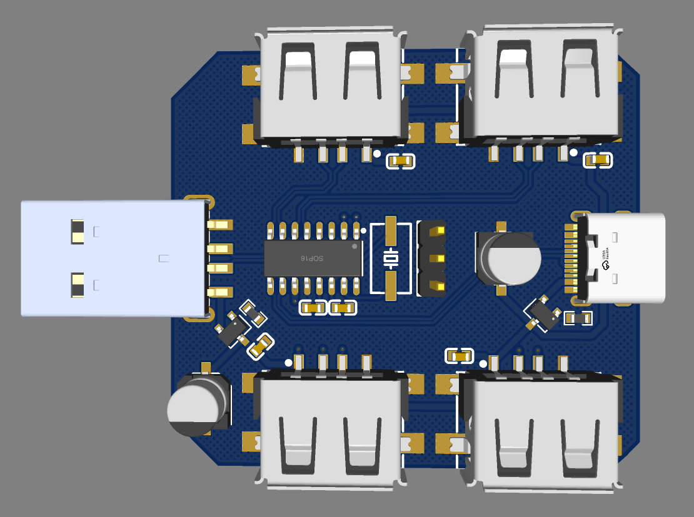
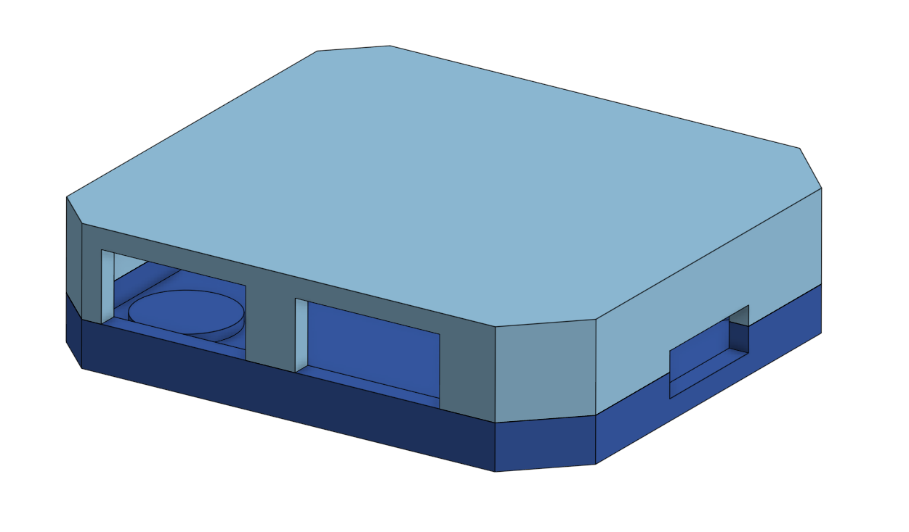
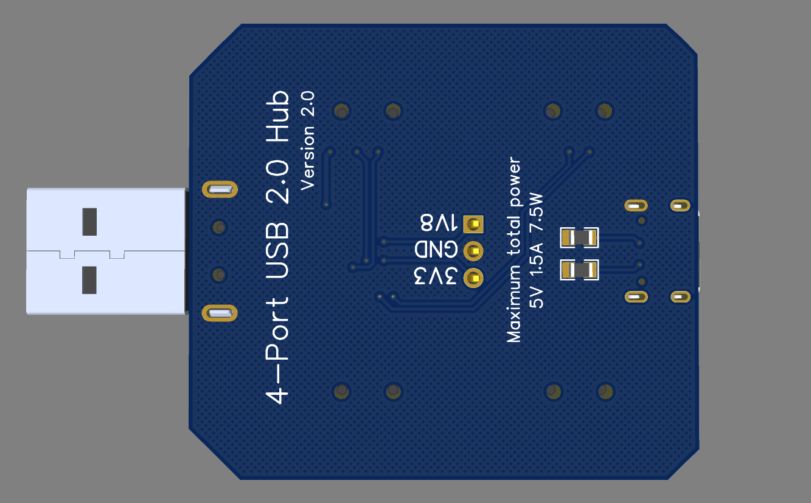
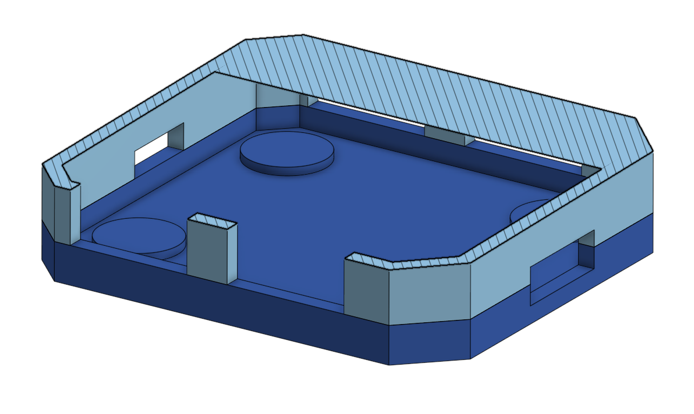
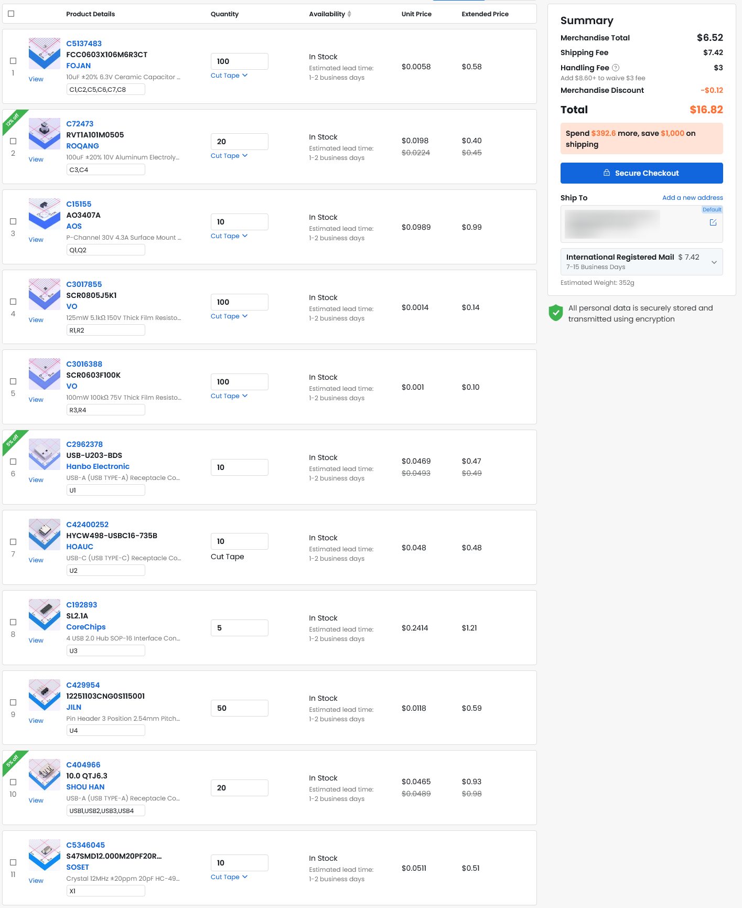
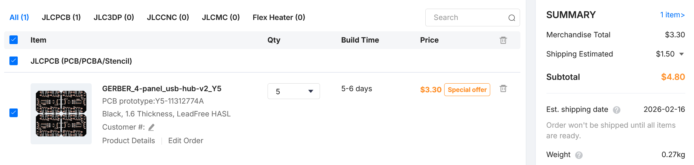

# usb-hub-v2
A 4 port USB hub that have both USB-A and USB-C connector for PC.

# About

This is a 4 port USB 2.0 hub, it has a reverse voltage diode in case the computer sends too much voltage and also has decoupling capacitors to protect the other USB ports. There's a USB-A and a USB-C port (Supports USB-C PD) that can be connected to a PC, although only one should be used at a time.

# Images

| PCB | 3D Preview | Case |
|-----|------------|------|
|  |  |          |
|                        |    |  |

# BOM

| Name                | Designator             | Quantity | Supplier | Supplier Part | URL                                                                                                      | Price         |
| ------------------- | ---------------------- | -------- | -------- | ------------- | -------------------------------------------------------------------------------------------------------- | ------------- |
| 100uF               | C4, C3                 | 10       | LCSC     | C72473        | [https://www.lcsc.com/product-detail/C72473.html](https://www.lcsc.com/product-detail/C72473.html)       | 0.40          |
| AO3407A             | Q1, Q2                 | 10       | LCSC     | C15155        | [https://www.lcsc.com/product-detail/C15155.html](https://www.lcsc.com/product-detail/C15155.html)       | 0.99          |
| 12MHz               | X1                     | 5        | LCSC     | C5346045      | [https://www.lcsc.com/product-detail/C5346045.html](https://www.lcsc.com/product-detail/C5346045.html)   | 0.51          |
| 10.0 QTJ6.3         | USB1, USB2, USB3, USB4 | 20       | LCSC     | C404966       | [https://www.lcsc.com/product-detail/C404966.html](https://www.lcsc.com/product-detail/C404966.html)     | 0.93          |
| HYCW498-USBC16-735B | U2                     | 5        | LCSC     | C42400252     | [https://www.lcsc.com/product-detail/C42400252.html](https://www.lcsc.com/product-detail/C42400252.html) | 0.48          |
| SL2.1A              | U3                     | 5        | LCSC     | C192893       | [https://www.lcsc.com/product-detail/C192893.html](https://www.lcsc.com/product-detail/C192893.html)     | 1.21          |
| 100kΩ               | R3, R4                 | 10       | LCSC     | C3016388      | [https://www.lcsc.com/product-detail/C3016388.html](https://www.lcsc.com/product-detail/C3016388.html)   | 0.59          |
| 12251103CNG0S115001 | U4                     | 5        | LCSC     | C429954       | [https://www.lcsc.com/product-detail/C429954.html](https://www.lcsc.com/product-detail/C429954.html)     | 0.10          |
| 10uF                | C1, C2, C5, C6, C7, C8 | 30       | LCSC     | C5137483      | [https://www.lcsc.com/product-detail/C5137483.html](https://www.lcsc.com/product-detail/C5137483.html)   | 0.58          |
| 5.1kΩ               | R1, R2                 | 10       | LCSC     | C3017855      | [https://www.lcsc.com/product-detail/C3017855.html](https://www.lcsc.com/product-detail/C3017855.html)   | 0.14          |
| USB-U203-BDS        | U1                     | 5        | LCSC     | C2962378      | [https://www.lcsc.com/product-detail/C2962378.html](https://www.lcsc.com/product-detail/C2962378.html)   | 0.47          |
| LCSC fees           | handling + shipping    | —        | —        | —             | —                                                                                                        | 10.42         |
| PCB                 | incl shipping          | 5        | JLCPCB   | —             | [https://jlcpcb.com](https://jlcpcb.com)                                                                 | 4.80          |
| **Total cost**      | —                      | —        | —        | —             | —                                                                                                        | **21.62 USD** |

Total: $21.62

