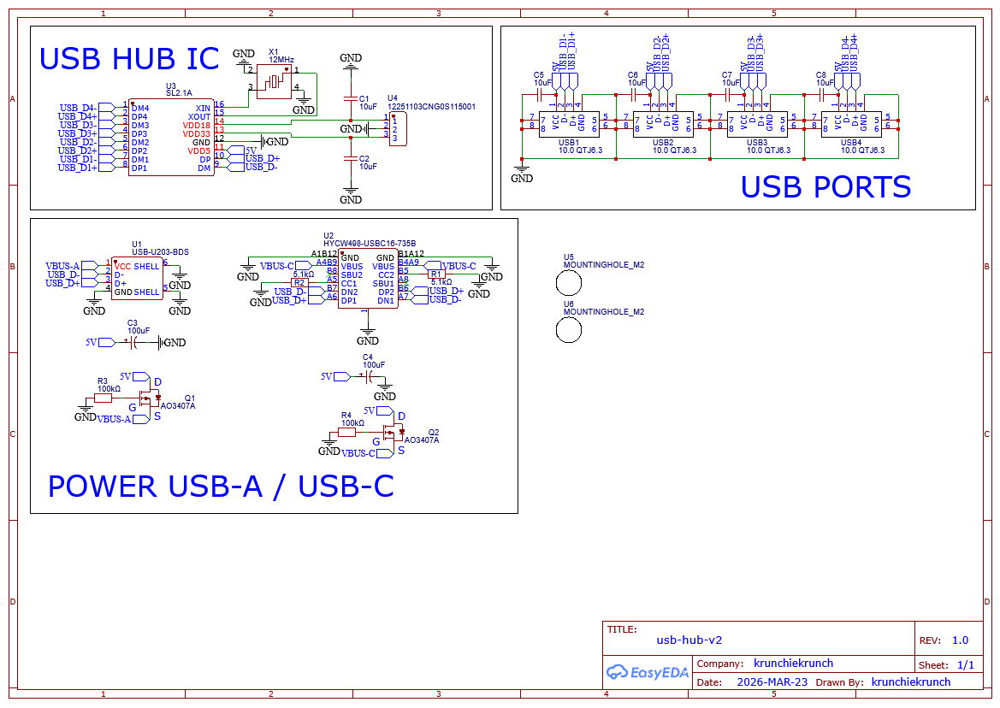
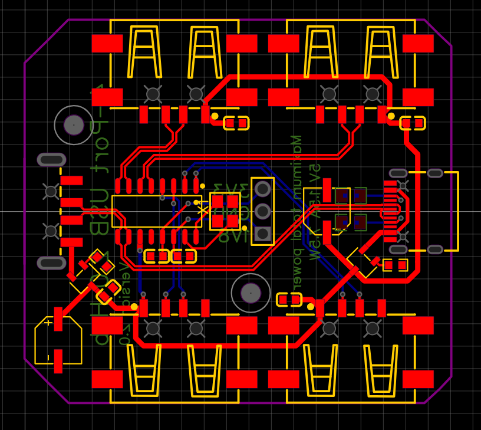
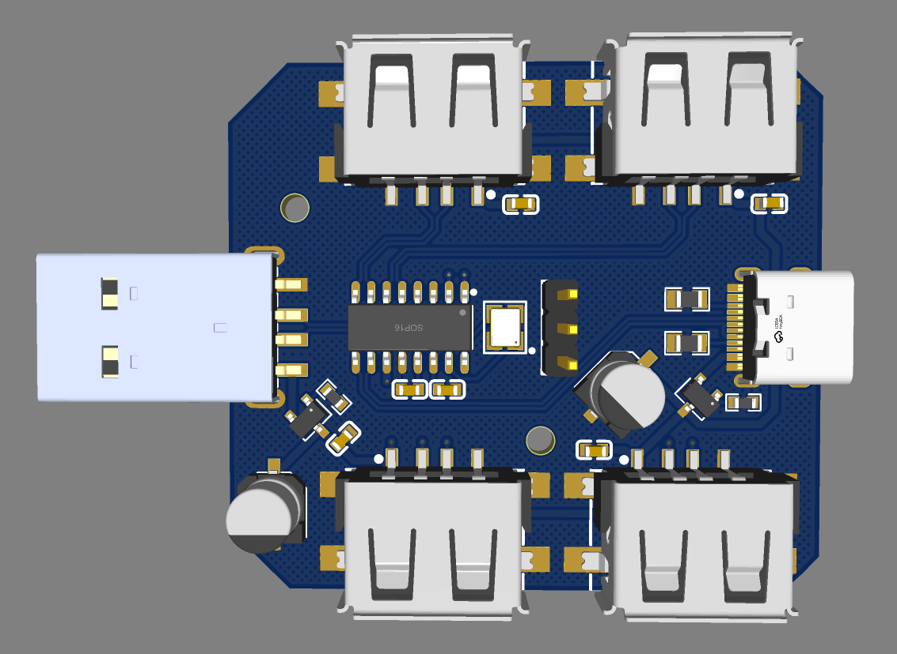
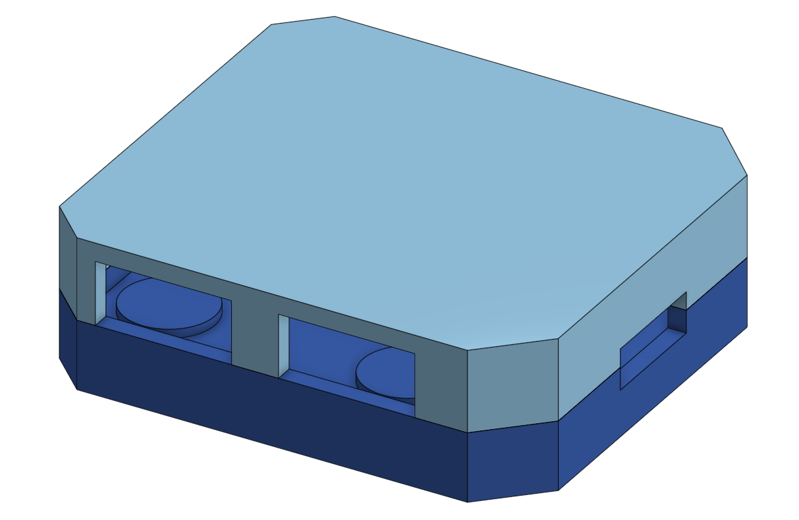
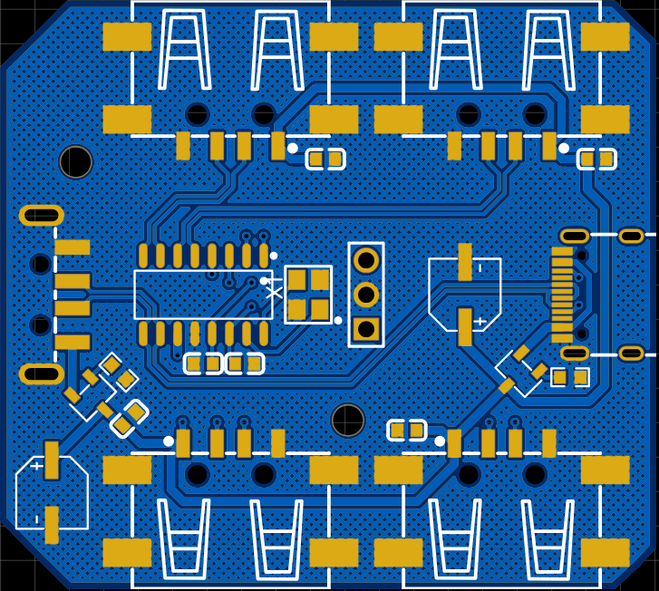
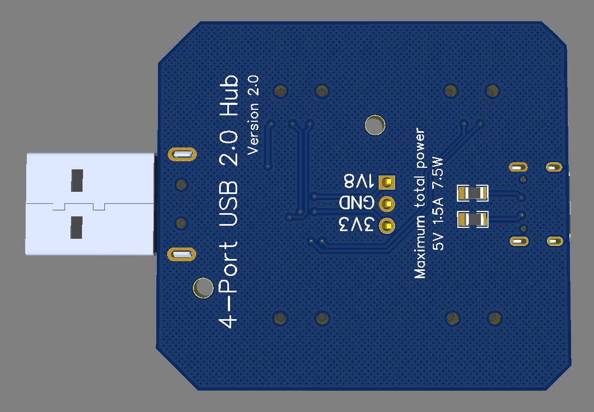
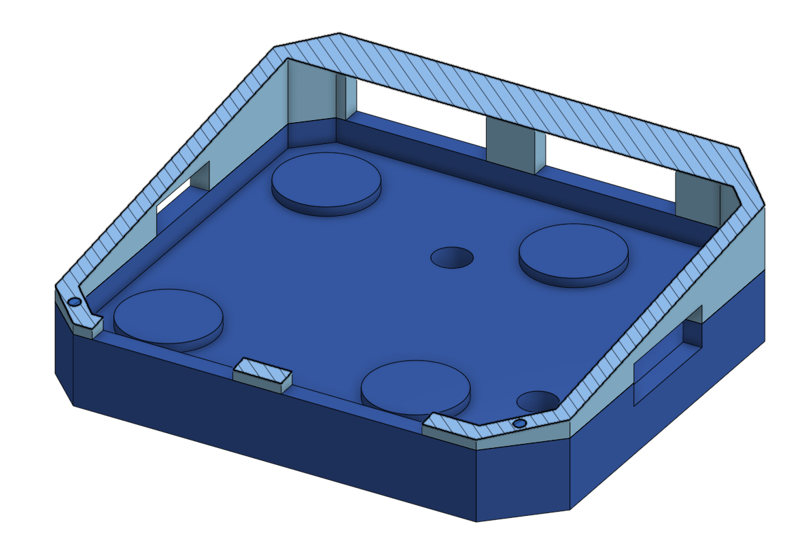
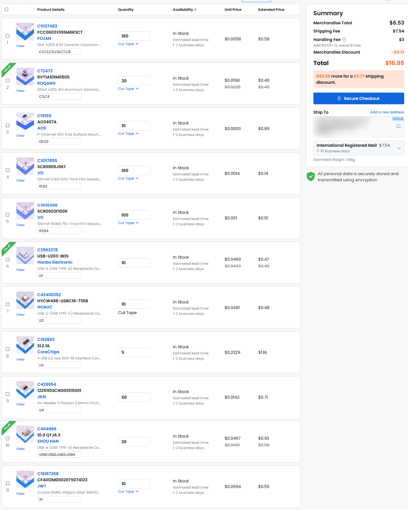
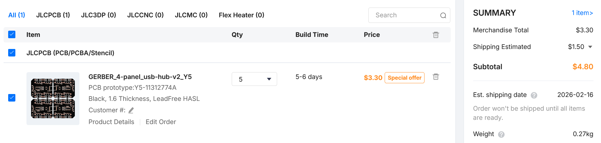
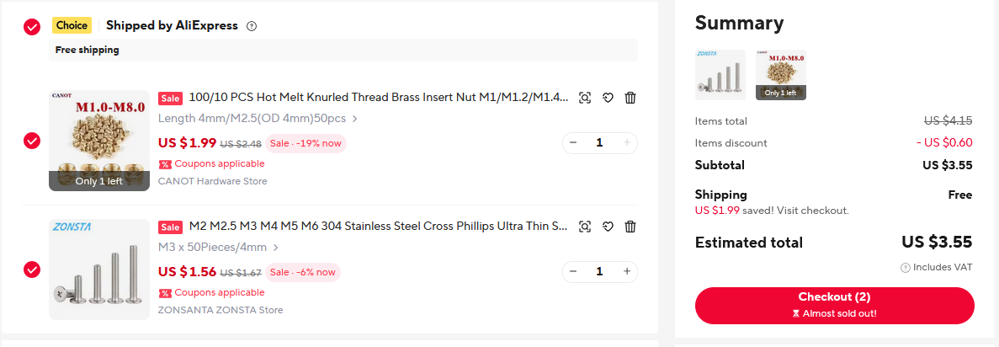

# usb-hub-v2
A 4 port USB hub that have both USB-A and USB-C connector for PC.

# About

This is a 4 port USB 2.0 hub, it has a reverse voltage diode in case the computer sends too much voltage and also has decoupling capacitors to protect the other USB ports. There's a USB-A and a USB-C port (Supports USB-C PD) that can be connected to a PC, although only one should be used at a time.

# Images

| PCB | 3D Preview | Case |
|-----|------------|------|
|       |  |          |
|  |    |  |

# Assembly instructions

Solder all the SMD components first, then the USB ports, insert and secure the heatset inserts in the 2 holes on the bottom of the case, then use 2x M3 screws (max 5.5mm) to screw in and secure the PCB, then align the friction lock poles and push the top of the case in.

# BOM

| LCSC#     | Customer #           | Quantity | Extended Price ($) | Product Link                                                                 |
|-----------|----------------------|----------|--------------------|------------------------------------------------------------------------------|
| C5137483  | C1,C2,C5,C6,C7,C8    | 100      | 0.58               | https://www.lcsc.com/product-detail/C5137483.html                           |
| C72473    | C3,C4                | 20       | 0.4                | https://www.lcsc.com/product-detail/C72473.html                             |
| C15155    | Q1,Q2                | 10       | 0.89               | https://www.lcsc.com/product-detail/C15155.html                             |
| C3017855  | R1,R2                | 100      | 0.14               | https://www.lcsc.com/product-detail/C3017855.html                           |
| C3016388  | R3,R4                | 100      | 0.1                | https://www.lcsc.com/product-detail/C3016388.html                           |
| C2962378  | U1                   | 10       | 0.47               | https://www.lcsc.com/product-detail/C2962378.html                           |
| C42400252 | U2                   | 10       | 0.48               | https://www.lcsc.com/product-detail/C42400252.html                          |
| C192893   | U3                   | 5        | 1.16               | https://www.lcsc.com/product-detail/C192893.html                            |
| C429954   | U4                   | 50       | 0.71               | https://www.lcsc.com/product-detail/C429954.html                            |
| C404966   | USB1,USB2,USB3,USB4  | 20       | 0.93               | https://www.lcsc.com/product-detail/C404966.html                            |
| C16197268 | X1                   | 10       | 0.55               | https://www.lcsc.com/product-detail/C16197268.html                          |
| —         | Heatset insert       | 2        | 1.99               | https://www.aliexpress.com/item/1005007640664497.html                       |
| —         | Screws               | 2        | 1.56               | https://www.aliexpress.com/item/1005003670389142.html                       |
| —         | LCSC Fees (Shipping+Handling) | — | 10.54              | —                                                                            |
| —         | PCB (incl shipping)  | —        | 4.8                | https://jlcpcb.com                                                          |
| **Total** | —                    | —        | **25.30 USD**      | —                                                                            |

