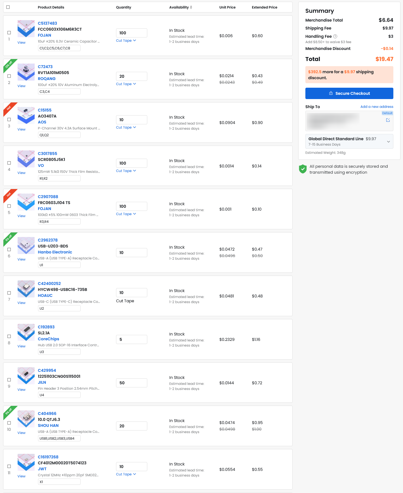
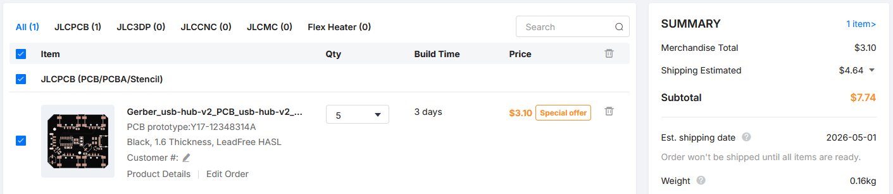
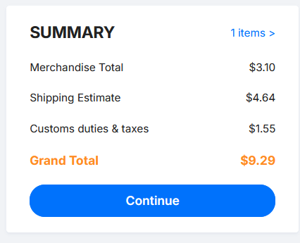
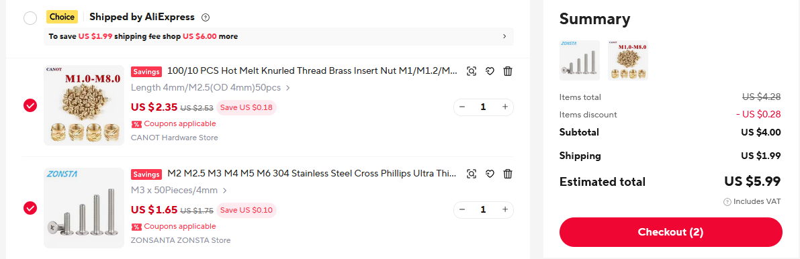

# usb-hub-v2

# About

This is a 4 port USB 2.0 hub, it has a reverse voltage protection circuit in case the devices sends too much voltage and also has decoupling capacitors to protect the host USB ports. There are both USB-A and a USB-C port (which Supports USB-C PD at 5V) that can be connected to a PC, although only one connector should be used to connect for data at a time, but the other one can be used to supply higher power to the devices.

# Why I made it

Previously, I made [usb-hub version 1](https://github.com/krunchiekrunch/usb-hub), but unfortunately, there were many flaws which made it so that it's incompatilable with many of my devices such as
- poorly placed decoupling capacitors
- a reverse voltage diode with a massive voltage drop
- the lack of a external crystal

 So I created version 2 which aims to solve those issues with the addition of
- a ground plane
- an external crystal
- differential traces for better signal integritiy
- P-Channel MOSFET for reverse voltage protection (Less voltage drop)
- SMD components for easier assembly
- a more secure case design. 

[OnShape Document](https://cad.onshape.com/documents/efce2298bdb4cf98a9c696d8/w/922ae4eee0c64909c767a4ca/e/18ffe383e3b3a38790e4ceb5)

As seen in the SL2.1A datasheet's reference circuit and many online designs, loading capacitors for the crystal is not required for this IC.

# Assembly instructions

Solder all the SMD components first, then the USB ports, insert and secure the heatset inserts in the 2 holes on the bottom of the case, then use 2x M3 screws (max 5.5mm) to screw in and secure the PCB, then align the friction lock poles and push the top of the case in.

# Images

| PCB | 3D Preview | Case |
|-----|------------|------|
|       |  |          |
|  |    |  |

# BOM

| LCSC#     | Customer #                    | Quantity | Extended Price($) | Product Link                                                                                                   |
| --------- | ----------------------------- | -------- | ----------------- | -------------------------------------------------------------------------------------------------------------- |
| C5137483  | C1,C2,C5,C6,C7,C8             | 100      | 0.6               | [https://www.lcsc.com/product-detail/C5137483.html](https://www.lcsc.com/product-detail/C5137483.html)         |
| C72473    | C3,C4                         | 20       | 0.43              | [https://www.lcsc.com/product-detail/C72473.html](https://www.lcsc.com/product-detail/C72473.html)             |
| C15155    | Q1,Q2                         | 10       | 0.9               | [https://www.lcsc.com/product-detail/C15155.html](https://www.lcsc.com/product-detail/C15155.html)             |
| C3017855  | R1,R2                         | 100      | 0.14              | [https://www.lcsc.com/product-detail/C3017855.html](https://www.lcsc.com/product-detail/C3017855.html)         |
| C2907088  | R3,R4                         | 100      | 0.1               | [https://www.lcsc.com/product-detail/C2907088.html](https://www.lcsc.com/product-detail/C2907088.html)         |
| C2962378  | U1                            | 10       | 0.47              | [https://www.lcsc.com/product-detail/C2962378.html](https://www.lcsc.com/product-detail/C2962378.html)         |
| C42400252 | U2                            | 10       | 0.48              | [https://www.lcsc.com/product-detail/C42400252.html](https://www.lcsc.com/product-detail/C42400252.html)       |
| C192893   | U3                            | 5        | 1.16              | [https://www.lcsc.com/product-detail/C192893.html](https://www.lcsc.com/product-detail/C192893.html)           |
| C429954   | U4                            | 50       | 0.72              | [https://www.lcsc.com/product-detail/C429954.html](https://www.lcsc.com/product-detail/C429954.html)           |
| C404966   | USB1,USB2,USB3,USB4           | 20       | 0.95              | [https://www.lcsc.com/product-detail/C404966.html](https://www.lcsc.com/product-detail/C404966.html)           |
| C16197268 | X1                            | 10       | 0.55              | [https://www.lcsc.com/product-detail/C16197268.html](https://www.lcsc.com/product-detail/C16197268.html)       |
|           | Heatset inserts (M2.5x4mm)    | 2        | 2.35              | [https://www.aliexpress.com/item/1005007640664497.html](https://www.aliexpress.com/item/1005007640664497.html) |
|           | Screws (M2.5x3mm)             | 2        | 1.47              | [https://www.aliexpress.com/item/1005003670389142.html](https://www.aliexpress.com/item/1005003670389142.html) |
|           | AliExpress Shipping           |          | 1.99              |                                                                                                                |
|           | LCSC Fees (Handling+Shipping) |          | 12.97             |                                                                                                                |
|           | PCB (Incl. shipping+VAT)      | 5        | 9.29              | [https://jlcpcb.com](https://jlcpcb.com)                                                                       |
| Total     |                               |          | 34.57             |                                                                                                                |

